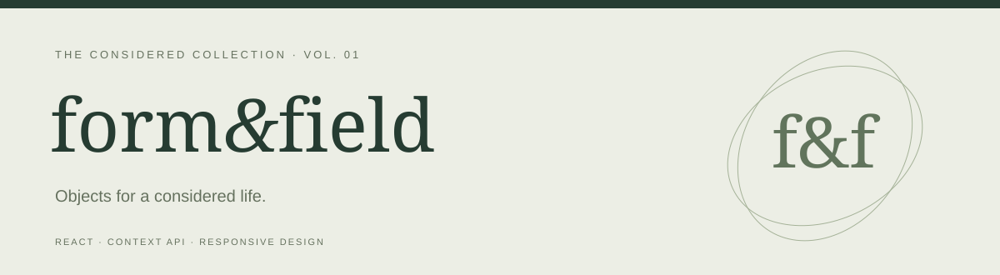

<p align="center"></p>

# Form & Field · React Shopping Cart

An original, responsive homewares storefront built with React, Context API, and Vite. Warm neutrals, forest green, editorial typography, and locally bundled photography bring a small collection of everyday objects to life.

**[Source repository](https://github.com/Avishek-Majumder/form-and-field-react-cart)** · **[Architecture](docs/architecture.md)** · **[Verification notes](docs/verification.md)**

## What you can do

- Browse eight products with images, categories, materials, and prices.
- Filter by category, search by name/material, and sort by price or name.
- Open a product dialog with details, dimensions, and care instructions.
- Add items in one click, increase/decrease quantities, or remove an entire line.
- See item counts, subtotals, shipping, and totals update immediately.
- Keep your bag and saved favorites after a page refresh.
- Review the bag and complete an explicitly labeled demo checkout.

The design adapts from a four-column desktop catalog to a two-column phone grid. Native dialogs support keyboard focus containment, Escape dismissal, and focus restoration. The UI also includes live announcements, descriptive labels, reduced-motion support, and useful empty states.

## Run locally

Use **Node.js 22.12 or newer** and npm.

```sh
git clone https://github.com/Avishek-Majumder/form-and-field-react-cart.git
cd form-and-field-react-cart
npm ci
npm run dev
```

Open the local URL printed by Vite, normally **http://127.0.0.1:5173**.

| Command                | Purpose                                 |
| ---------------------- | --------------------------------------- |
| `npm run dev`          | Start the development server            |
| `npm test`             | Run 20 unit and integration tests       |
| `npm run test:watch`   | Run tests while developing              |
| `npm run format:check` | Check consistent source formatting      |
| `npm run format`       | Format source and documentation         |
| `npm run build`        | Create the production bundle in `dist/` |
| `npm run preview`      | Serve the production build locally      |

No API key, environment file, backend, or external product API is required.

## Architecture

```text
src/
├── components/      # Storefront, product grid, cart, and accessible dialogs
├── context/         # Cart provider, state transitions, and total calculations
├── data/            # Curated product catalog and currency formatter
├── hooks/           # useCart and fault-tolerant usePersistentState
├── test/            # Cart edge cases and full shopping-flow integration tests
├── App.jsx          # Catalog filters, saved objects, and active dialog
├── main.jsx         # React root and CartProvider
└── styles.css       # Design tokens, component styling, and breakpoints
```

**React Hooks + Context API:** a single cart provider owns the bag. Components consume state and actions through `useCart`; totals are derived rather than stored independently.

**Reliable arithmetic:** prices are integer cents. Standard demo shipping is $8.95 below $150 and free at or above $150. Empty bags never incur shipping.

**Safe persistence:** browser storage keeps only known product IDs and integer quantities. Invalid data is discarded, duplicate lines are merged, and quantities are capped at 99 per product. Storage failures fall back to in-memory use.

See [the architecture notes](docs/architecture.md) for more detail.

## Quality checks

The GitHub Actions workflow runs formatting, tests, and the production build on pushes to `main` and pull requests. Tests cover cart operations, totals, the exact shipping threshold, persistence, malformed data, denied storage, search, sorting, favorites, product details, and demo checkout.

Manual browser checks and their limits are recorded in [verification notes](docs/verification.md).

## Deployment

This is a static application. Run `npm run build` and publish the contents of `dist/` to a static host such as Netlify, Vercel, or GitHub Pages. The Vite configuration uses a relative asset base so it can also be served from a repository subdirectory.

- Build command: `npm run build`
- Output directory: `dist`
- Node version: 22.12+
- No server-side routing or environment variables required

## Scope and credits

Form & Field is a fictional store for the **React Shopping Cart Application** assignment. Products, specifications, availability, and store policies are illustrative. Demo checkout clears the bag and shows a confirmation; it does **not** process payments or create real orders.

The [assignment reference](https://startling-beijinho-72802b.netlify.app/) informed the catalog-to-cart flow. Branding, composition, and implementation are original to this project.

Photography: [Unsplash](https://unsplash.com) — [individual asset references](public/images/README.md). Typography: DM Sans and DM Serif Display through Fontsource. Icons: Lucide.
